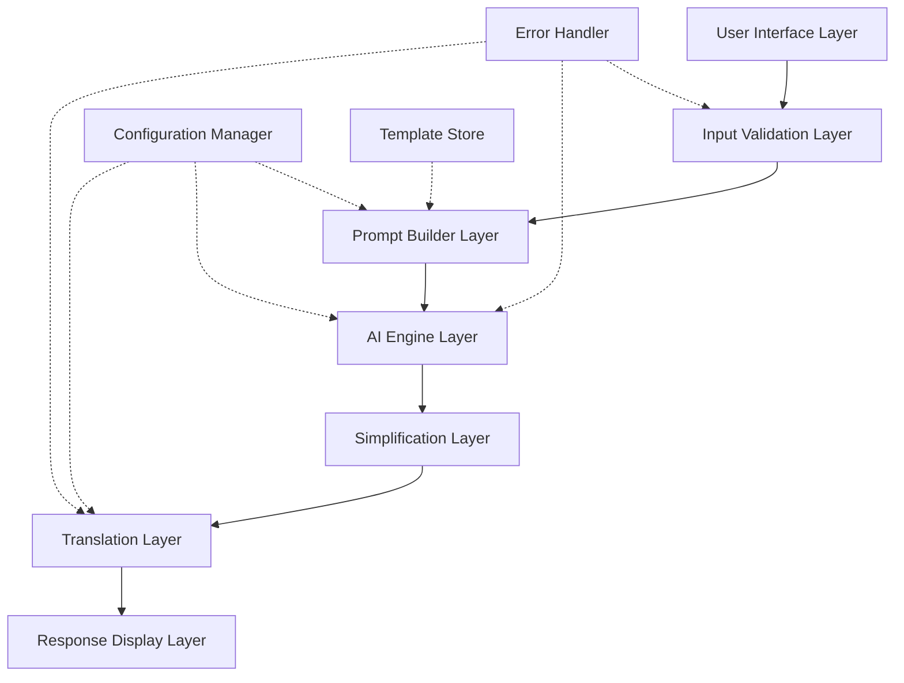
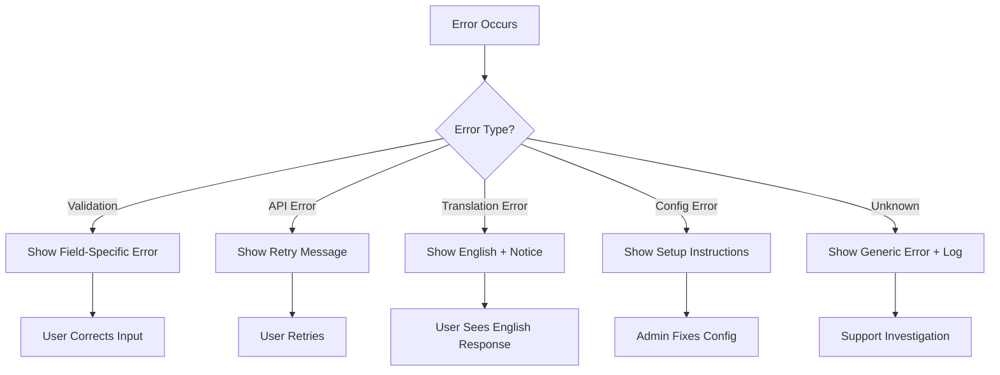

# Design Document: AI Bharat Saathi

## Overview

AI Bharat Saathi is a web-based AI assistant that provides simplified, structured information in multiple Indian languages across three specialized modes: Learning, Career Guidance, and Government Schemes. The system follows a pipeline architecture where user input flows through prompt construction, AI generation, simplification, and optional translation before being presented to the user.

The design emphasizes simplicity, accessibility, and responsible AI practices. The system uses a Streamlit-based web interface for ease of deployment and maintenance, integrates with a large language model API for content generation, and employs a translation service for multi-language support.

## Architecture

The system follows a layered pipeline architecture with clear separation of concerns:



### Layer Responsibilities

1. **User Interface Layer**: Streamlit-based web interface that collects user input (query text, mode selection, language selection) and displays responses
2. **Input Validation Layer**: Validates user input for completeness and correctness before processing
3. **Prompt Builder Layer**: Constructs AI prompts by combining user queries with mode-specific templates
4. **AI Engine Layer**: Interfaces with the LLM API to generate responses based on constructed prompts
5. **Simplification Layer**: Ensures responses are structured with bullet points, headings, and beginner-friendly formatting
6. **Translation Layer**: Translates responses into the selected Indian language while preserving structure
7. **Response Display Layer**: Renders the final structured response in the UI

### Supporting Components

- **Configuration Manager**: Manages API keys, model settings, and translation service configuration
- **Template Store**: Stores and retrieves mode-specific prompt templates
- **Error Handler**: Provides consistent error handling and user-friendly error messages across all layers

## Components and Interfaces

### 1. User Interface Component

**Technology**: Streamlit

**Responsibilities**:
- Display input form with text area, mode selector, and language dropdown
- Show disclaimer about informational nature of guidance
- Display loading indicators during processing
- Render structured responses with proper formatting
- Handle mobile-responsive layout

**Interface**:
```python
class UserInterface:
    def render_input_form() -> tuple[str, Mode, Language]:
        """Renders input form and returns user selections"""
        
    def display_loading():
        """Shows loading indicator"""
        
    def display_response(response: StructuredResponse):
        """Renders the final response with formatting"""
        
    def display_error(error_message: str):
        """Shows user-friendly error message"""
        
    def display_disclaimer():
        """Shows disclaimer about informational guidance"""
```

### 2. Input Validator Component

**Responsibilities**:
- Validate query text is non-empty and within length limits
- Validate mode selection is one of the three supported modes
- Validate language selection is supported
- Return validation errors with specific guidance

**Interface**:
```python
class InputValidator:
    def validate_query(query: str) -> ValidationResult:
        """Validates query text (non-empty, max 1000 chars)"""
        
    def validate_mode(mode: str) -> ValidationResult:
        """Validates mode is Learning, Career, or Schemes"""
        
    def validate_language(language: str) -> ValidationResult:
        """Validates language is in supported list"""
        
    def validate_all(query: str, mode: str, language: str) -> ValidationResult:
        """Validates all inputs together"""
```

**Data Types**:
```python
@dataclass
class ValidationResult:
    is_valid: bool
    error_message: Optional[str]
    field_name: Optional[str]
```

### 3. Prompt Builder Component

**Responsibilities**:
- Load mode-specific templates from template store
- Combine user query with template instructions
- Include formatting and simplification instructions
- Generate complete prompt for AI engine

**Interface**:
```python
class PromptBuilder:
    def __init__(self, template_store: TemplateStore):
        self.template_store = template_store
        
    def build_prompt(query: str, mode: Mode) -> str:
        """Constructs complete prompt from query and mode template"""
        
    def get_template(mode: Mode) -> str:
        """Retrieves template for specified mode"""
```

**Templates**:

*Learning Mode Template*:
```
You are a helpful teacher explaining concepts to a 15-year-old student.

User Question: {query}

Please provide:
1. A simple step-by-step explanation
2. At least one practical example
3. Simple definitions for any technical terms
4. Use bullet points and clear headings

Keep language simple and beginner-friendly.
```

*Career Guidance Mode Template*:
```
You are a career counselor helping students and job seekers.

User Question: {query}

Please provide:
1. Relevant career path suggestions
2. Required skills for each path
3. Actionable next learning steps
4. A structured roadmap format

Use simple language and avoid jargon.
```

*Government Scheme Mode Template*:
```
You are explaining government schemes to citizens in simple terms.

User Question: {query}

Please provide:
1. Scheme name and purpose in simple language
2. Eligibility criteria in bullet points
3. Key benefits in everyday language
4. Required documents (if applicable)

Avoid bureaucratic jargon and use common vocabulary.
```

### 4. AI Engine Component

**Responsibilities**:
- Interface with LLM API (OpenAI, Anthropic, or similar)
- Send constructed prompts and receive responses
- Handle API errors and timeouts
- Enforce response length limits
- Manage API rate limiting

**Interface**:
```python
class AIEngine:
    def __init__(self, config: AIConfig):
        self.api_key = config.api_key
        self.model_name = config.model_name
        self.max_tokens = config.max_tokens
        
    def generate_response(prompt: str) -> AIResponse:
        """Sends prompt to LLM API and returns response"""
        
    def check_api_health() -> bool:
        """Checks if API is available"""
```

**Data Types**:
```python
@dataclass
class AIConfig:
    api_key: str
    model_name: str
    max_tokens: int
    temperature: float
    
@dataclass
class AIResponse:
    success: bool
    content: Optional[str]
    error_message: Optional[str]
    tokens_used: int
```

### 5. Simplification Layer Component

**Responsibilities**:
- Parse AI-generated response
- Ensure proper formatting with bullet points and headings
- Break long paragraphs into shorter segments
- Verify beginner-friendly language
- Structure output consistently

**Interface**:
```python
class SimplificationLayer:
    def simplify_response(raw_response: str) -> StructuredResponse:
        """Formats and structures the AI response"""
        
    def ensure_bullet_points(text: str) -> str:
        """Converts paragraphs to bullet points where appropriate"""
        
    def add_section_headings(text: str) -> str:
        """Adds clear section headings"""
        
    def break_long_paragraphs(text: str) -> str:
        """Splits long paragraphs into shorter segments"""
```

**Data Types**:
```python
@dataclass
class StructuredResponse:
    sections: List[Section]
    total_length: int
    
@dataclass
class Section:
    heading: str
    content: List[str]  # List of bullet points or paragraphs
```

### 6. Translation Module Component

**Responsibilities**:
- Translate structured responses into selected Indian language
- Preserve formatting (bullet points, headings, structure)
- Maintain simple vocabulary in target language
- Handle translation errors gracefully
- Bypass translation for English output

**Interface**:
```python
class TranslationModule:
    def __init__(self, config: TranslationConfig):
        self.api_key = config.api_key
        self.service = config.service  # Google Translate, Azure, etc.
        
    def translate_response(response: StructuredResponse, 
                          target_language: Language) -> TranslatedResponse:
        """Translates response while preserving structure"""
        
    def translate_text(text: str, target_language: Language) -> str:
        """Translates a single text segment"""
        
    def is_translation_needed(target_language: Language) -> bool:
        """Returns False if target is English"""
```

**Data Types**:
```python
@dataclass
class TranslationConfig:
    api_key: str
    service: str  # "google", "azure", "aws"
    
@dataclass
class TranslatedResponse:
    success: bool
    translated_content: Optional[StructuredResponse]
    error_message: Optional[str]
    source_language: str
    target_language: str
```

### 7. Configuration Manager Component

**Responsibilities**:
- Load configuration from environment variables
- Validate required configuration is present
- Provide configuration to other components
- Support multiple translation service providers

**Interface**:
```python
class ConfigurationManager:
    def load_config() -> AppConfig:
        """Loads configuration from environment variables"""
        
    def validate_config(config: AppConfig) -> ValidationResult:
        """Validates all required config is present"""
        
    def get_ai_config() -> AIConfig:
        """Returns AI engine configuration"""
        
    def get_translation_config() -> TranslationConfig:
        """Returns translation service configuration"""
```

**Data Types**:
```python
@dataclass
class AppConfig:
    ai_config: AIConfig
    translation_config: TranslationConfig
    supported_languages: List[Language]
    max_query_length: int
    response_timeout: int
```

### 8. Error Handler Component

**Responsibilities**:
- Provide consistent error handling across layers
- Generate user-friendly error messages
- Log errors for debugging
- Suggest corrective actions to users

**Interface**:
```python
class ErrorHandler:
    def handle_validation_error(error: ValidationResult) -> str:
        """Returns user-friendly validation error message"""
        
    def handle_api_error(error: Exception) -> str:
        """Returns user-friendly API error message"""
        
    def handle_translation_error(error: Exception) -> str:
        """Returns user-friendly translation error message"""
        
    def log_error(error: Exception, context: dict):
        """Logs error details for debugging"""
```

## Data Models

### Core Enumerations

```python
from enum import Enum

class Mode(Enum):
    LEARNING = "learning"
    CAREER = "career_guidance"
    SCHEMES = "government_schemes"

class Language(Enum):
    ENGLISH = "en"
    HINDI = "hi"
    TAMIL = "ta"
    TELUGU = "te"
    BENGALI = "bn"
    MARATHI = "mr"
    GUJARATI = "gu"
    KANNADA = "kn"
    MALAYALAM = "ml"
    PUNJABI = "pa"
```

### Request and Response Models

```python
@dataclass
class UserRequest:
    query: str
    mode: Mode
    output_language: Language
    timestamp: datetime

@dataclass
class ProcessingContext:
    request: UserRequest
    prompt: str
    ai_response: AIResponse
    structured_response: StructuredResponse
    final_response: TranslatedResponse
    processing_time: float
```

### Template Models

```python
@dataclass
class PromptTemplate:
    mode: Mode
    template_text: str
    instructions: List[str]
    
class TemplateStore:
    def __init__(self):
        self.templates: Dict[Mode, PromptTemplate] = {}
        
    def load_templates():
        """Loads all mode templates"""
        
    def get_template(mode: Mode) -> PromptTemplate:
        """Retrieves template for mode"""
```

## System Flow

### Main Processing Pipeline

```python
def process_user_request(query: str, mode: str, language: str) -> str:
    """
    Main processing pipeline for user requests
    
    Steps:
    1. Validate input
    2. Build prompt
    3. Generate AI response
    4. Simplify and structure
    5. Translate if needed
    6. Return formatted response
    """
    
    # Step 1: Validate
    validation = validator.validate_all(query, mode, language)
    if not validation.is_valid:
        return error_handler.handle_validation_error(validation)
    
    # Step 2: Build prompt
    mode_enum = Mode(mode)
    prompt = prompt_builder.build_prompt(query, mode_enum)
    
    # Step 3: Generate AI response
    ai_response = ai_engine.generate_response(prompt)
    if not ai_response.success:
        return error_handler.handle_api_error(ai_response.error_message)
    
    # Step 4: Simplify and structure
    structured = simplification_layer.simplify_response(ai_response.content)
    
    # Step 5: Translate if needed
    language_enum = Language(language)
    if translation_module.is_translation_needed(language_enum):
        translated = translation_module.translate_response(
            structured, language_enum
        )
        if not translated.success:
            # Fall back to English with error notice
            return format_response_with_translation_error(structured)
        final_response = translated.translated_content
    else:
        final_response = structured
    
    # Step 6: Return formatted response
    return format_response(final_response)
```

### Error Handling Flow



## Implementation Details

### Streamlit Application Structure

```python
# app.py - Main Streamlit application

import streamlit as st
from components import (
    InputValidator, PromptBuilder, AIEngine,
    SimplificationLayer, TranslationModule,
    ConfigurationManager, ErrorHandler
)

def main():
    # Initialize components
    config = ConfigurationManager.load_config()
    validator = InputValidator()
    prompt_builder = PromptBuilder(TemplateStore())
    ai_engine = AIEngine(config.ai_config)
    simplification = SimplificationLayer()
    translation = TranslationModule(config.translation_config)
    error_handler = ErrorHandler()
    
    # Display disclaimer
    st.info("ℹ️ This assistant provides informational guidance only. "
            "Please verify important information with official sources.")
    
    # Render UI
    st.title("🇮🇳 AI Bharat Saathi")
    st.subheader("Your Learning and Opportunity Assistant")
    
    # Input form
    query = st.text_area("Ask your question:", max_chars=1000, height=150)
    
    col1, col2 = st.columns(2)
    with col1:
        mode = st.selectbox("Select Mode:", 
                           ["Learning", "Career Guidance", "Government Schemes"])
    with col2:
        language = st.selectbox("Output Language:",
                               ["English", "Hindi", "Tamil", "Telugu", 
                                "Bengali", "Marathi", "Gujarati", "Kannada",
                                "Malayalam", "Punjabi"])
    
    if st.button("Get Answer", type="primary"):
        if query.strip():
            with st.spinner("Processing your question..."):
                response = process_user_request(query, mode, language)
                st.markdown(response)
        else:
            st.error("Please enter a question.")

if __name__ == "__main__":
    main()
```

### Configuration via Environment Variables

```python
# config.py

import os
from dataclasses import dataclass

@dataclass
class Config:
    # AI Engine
    AI_API_KEY: str = os.getenv("AI_API_KEY", "")
    AI_MODEL: str = os.getenv("AI_MODEL", "gpt-3.5-turbo")
    AI_MAX_TOKENS: int = int(os.getenv("AI_MAX_TOKENS", "1500"))
    AI_TEMPERATURE: float = float(os.getenv("AI_TEMPERATURE", "0.7"))
    
    # Translation
    TRANSLATION_API_KEY: str = os.getenv("TRANSLATION_API_KEY", "")
    TRANSLATION_SERVICE: str = os.getenv("TRANSLATION_SERVICE", "google")
    
    # Application
    MAX_QUERY_LENGTH: int = 1000
    RESPONSE_TIMEOUT: int = 15
    
    def validate(self) -> tuple[bool, str]:
        """Validates required configuration"""
        if not self.AI_API_KEY:
            return False, "AI_API_KEY environment variable is required"
        if not self.TRANSLATION_API_KEY:
            return False, "TRANSLATION_API_KEY environment variable is required"
        return True, ""
```

### Template Storage

Templates are stored as Python strings in a dedicated module:

```python
# templates.py

LEARNING_TEMPLATE = """
You are a helpful teacher explaining concepts to a 15-year-old student.

User Question: {query}

Please provide:
1. A simple step-by-step explanation
2. At least one practical example
3. Simple definitions for any technical terms
4. Use bullet points and clear headings

Keep language simple and beginner-friendly. Structure your response with clear sections.
"""

CAREER_TEMPLATE = """
You are a career counselor helping students and job seekers.

User Question: {query}

Please provide:
1. Relevant career path suggestions (at least one)
2. Required skills for each path
3. Actionable next learning steps
4. A structured roadmap format

Use simple language and avoid jargon. Format as a clear progression.
"""

SCHEMES_TEMPLATE = """
You are explaining government schemes to citizens in simple terms.

User Question: {query}

Please provide:
1. Scheme name and purpose in simple language
2. Eligibility criteria in bullet points
3. Key benefits in everyday language
4. Required documents (if applicable)

Avoid bureaucratic jargon and use common vocabulary. Make it easy to understand.
"""

TEMPLATE_MAP = {
    Mode.LEARNING: LEARNING_TEMPLATE,
    Mode.CAREER: CAREER_TEMPLATE,
    Mode.SCHEMES: SCHEMES_TEMPLATE
}
```


## Correctness Properties

*A property is a characteristic or behavior that should hold true across all valid executions of a system—essentially, a formal statement about what the system should do. Properties serve as the bridge between human-readable specifications and machine-verifiable correctness guarantees.*

### Property 1: Input Validation Completeness

*For any* user input consisting of query text, mode selection, and language selection, the validation function should accept valid inputs (non-empty queries up to 1000 chars, valid modes, supported languages) and reject invalid inputs with specific error messages indicating which field failed validation.

**Validates: Requirements 1.1, 1.2, 1.3, 1.4, 1.5**

### Property 2: Mode-Template Mapping Consistency

*For any* mode selection (Learning, Career Guidance, or Government Schemes), the prompt builder should retrieve the unique template associated with that mode, and the constructed prompt should contain both the user query and the mode-specific template instructions.

**Validates: Requirements 2.1, 3.1, 4.1, 5.1, 5.2, 5.5**

### Property 3: Response Structure Consistency

*For any* AI-generated response processed by the simplification layer, the structured output should contain clear section headings, formatted lists (bullet points or numbered), and maintain consistent structural elements regardless of the mode or content.

**Validates: Requirements 2.5, 3.5, 7.1, 7.2, 13.4**

### Property 4: Paragraph Segmentation

*For any* text containing paragraphs longer than a threshold (e.g., 200 words), the simplification layer should break them into shorter segments while preserving meaning and maintaining proper formatting.

**Validates: Requirements 7.3**

### Property 5: AI Engine Response Extraction

*For any* successful API response from the language model, the AI engine should extract the text content and return it in a structured format with success status and token usage information.

**Validates: Requirements 6.2**

### Property 6: Response Length Enforcement

*For any* AI-generated response, the system should enforce a maximum length limit (2000 words), either by configuring the API request appropriately or by truncating responses that exceed the limit.

**Validates: Requirements 6.4**

### Property 7: Error Message Generation

*For any* error condition (validation failure, API error, translation error, configuration error), the system should return a user-friendly error message that describes the problem and suggests corrective action, without exposing technical implementation details.

**Validates: Requirements 1.5, 6.3, 12.1, 12.2, 12.3, 12.5**

### Property 8: Translation Conditional Logic

*For any* output language selection, if the language is English, the translation module should bypass translation and return the original structured response; if the language is non-English, the translation module should invoke the translation service.

**Validates: Requirements 8.1, 8.4**

### Property 9: Translation Structure Preservation

*For any* structured response that undergoes translation, the translated output should preserve all structural elements including section headings, bullet points, numbered lists, and formatting markers from the original response.

**Validates: Requirements 8.2**

### Property 10: Translation Fallback Behavior

*For any* translation request that fails (due to API error, timeout, or service unavailability), the system should return the original English response along with a notification message informing the user that translation was unsuccessful.

**Validates: Requirements 8.5, 12.4**

### Property 11: Data Persistence Restriction

*For any* user session, the system should not write user queries, responses, or personal information to persistent storage (files, databases) beyond temporary in-memory storage required for processing the current request.

**Validates: Requirements 11.3**

### Property 12: Configuration Loading from Environment

*For any* system startup, the configuration manager should load all settings (API keys, model names, service providers) from environment variables, and if any required variable is missing, should return a validation error with the specific missing parameter name.

**Validates: Requirements 15.1, 15.2, 15.4, 15.5**

### Property 13: Language Support Coverage

*For any* query about supported languages, the system should provide a list containing English, Hindi, and at least 8 additional Indian languages (Tamil, Telugu, Bengali, Marathi, Gujarati, Kannada, Malayalam, Punjabi), totaling at least 10 supported output languages.

**Validates: Requirements 14.1, 14.2, 14.3**

### Property 14: Prompt Query Inclusion

*For any* user query and selected mode, the constructed prompt should contain the complete user query text as a substring, ensuring that the AI engine receives the user's actual question.

**Validates: Requirements 5.2**

### Property 15: Template Distinctness

*For all* three modes (Learning, Career Guidance, Government Schemes), each mode should have a distinct template that differs in content and instructions from the other two modes, ensuring mode-specific guidance.

**Validates: Requirements 5.4**

## Error Handling

### Error Categories and Responses

The system handles errors at multiple layers with consistent user-facing messages:

#### 1. Input Validation Errors

**Trigger**: Empty query, invalid mode, unsupported language

**Response**:
- Field-specific error message
- Highlight the problematic field
- Suggest valid options
- Example: "Please enter a question (cannot be empty)"
- Example: "Please select a valid mode: Learning, Career Guidance, or Government Schemes"

**Implementation**:
```python
class ValidationError(Exception):
    def __init__(self, field: str, message: str):
        self.field = field
        self.message = message
        
def handle_validation_error(error: ValidationError) -> str:
    return f"❌ {error.field}: {error.message}"
```

#### 2. AI API Errors

**Trigger**: API key invalid, rate limit exceeded, API timeout, service unavailable

**Response**:
- User-friendly explanation
- Suggest retry action
- Avoid exposing API details
- Example: "Unable to process your request right now. Please try again in a moment."
- Example: "Service is temporarily busy. Please wait a few seconds and retry."

**Implementation**:
```python
def handle_ai_api_error(error: Exception) -> str:
    if isinstance(error, AuthenticationError):
        return "⚠️ Service configuration issue. Please contact support."
    elif isinstance(error, RateLimitError):
        return "⏳ Service is busy. Please wait 30 seconds and try again."
    elif isinstance(error, TimeoutError):
        return "⏱️ Request timed out. Please try again."
    else:
        return "❌ Unable to process request. Please try again later."
```

#### 3. Translation Errors

**Trigger**: Translation API failure, unsupported language pair, timeout

**Response**:
- Display English response as fallback
- Show notification about translation failure
- Suggest trying again
- Example: "Translation to Hindi unavailable. Showing response in English."

**Implementation**:
```python
def handle_translation_error(
    english_response: StructuredResponse,
    target_language: Language,
    error: Exception
) -> str:
    notification = (
        f"ℹ️ Translation to {target_language.name} is currently unavailable. "
        f"Showing response in English.\n\n"
    )
    return notification + format_response(english_response)
```

#### 4. Configuration Errors

**Trigger**: Missing environment variables, invalid configuration values

**Response**:
- Clear message about missing configuration
- Specify which parameter is missing
- Provide setup instructions
- Example: "Configuration error: AI_API_KEY environment variable is required"

**Implementation**:
```python
def validate_configuration(config: Config) -> ValidationResult:
    errors = []
    
    if not config.AI_API_KEY:
        errors.append("AI_API_KEY environment variable is required")
    if not config.TRANSLATION_API_KEY:
        errors.append("TRANSLATION_API_KEY environment variable is required")
    
    if errors:
        return ValidationResult(
            is_valid=False,
            error_message="Configuration errors:\n" + "\n".join(f"- {e}" for e in errors)
        )
    
    return ValidationResult(is_valid=True, error_message=None)
```

#### 5. Unexpected Errors

**Trigger**: Unhandled exceptions, system errors

**Response**:
- Generic user-friendly message
- Log detailed error for debugging
- Suggest contacting support
- Example: "An unexpected error occurred. Please try again or contact support if the issue persists."

**Implementation**:
```python
import logging

logger = logging.getLogger(__name__)

def handle_unexpected_error(error: Exception, context: dict) -> str:
    # Log detailed error for debugging
    logger.error(
        f"Unexpected error: {type(error).__name__}: {str(error)}",
        extra=context,
        exc_info=True
    )
    
    # Return generic user message
    return (
        "❌ An unexpected error occurred. "
        "Please try again or contact support if the issue persists."
    )
```

### Error Logging Strategy

All errors are logged with contextual information for debugging:

```python
@dataclass
class ErrorContext:
    timestamp: datetime
    user_query: str
    selected_mode: Mode
    selected_language: Language
    error_type: str
    error_message: str
    stack_trace: Optional[str]
    
def log_error(error: Exception, request: UserRequest):
    context = ErrorContext(
        timestamp=datetime.now(),
        user_query=request.query[:100],  # Truncate for privacy
        selected_mode=request.mode,
        selected_language=request.output_language,
        error_type=type(error).__name__,
        error_message=str(error),
        stack_trace=traceback.format_exc()
    )
    
    logger.error(f"Error processing request: {context}")
```

### Retry Logic

For transient errors (API timeouts, rate limits), implement exponential backoff:

```python
import time
from typing import Callable, TypeVar

T = TypeVar('T')

def retry_with_backoff(
    func: Callable[[], T],
    max_attempts: int = 3,
    initial_delay: float = 1.0
) -> T:
    """Retry function with exponential backoff"""
    
    for attempt in range(max_attempts):
        try:
            return func()
        except (TimeoutError, RateLimitError) as e:
            if attempt == max_attempts - 1:
                raise
            
            delay = initial_delay * (2 ** attempt)
            time.sleep(delay)
    
    raise Exception("Max retry attempts exceeded")
```

## Testing Strategy

The testing strategy for AI Bharat Saathi employs a dual approach combining unit tests for specific scenarios and property-based tests for universal correctness properties. This ensures both concrete functionality and general system behavior are validated.

### Testing Approach Overview

**Unit Tests**: Validate specific examples, edge cases, error conditions, and integration points between components. Focus on concrete scenarios that demonstrate correct behavior.

**Property-Based Tests**: Validate universal properties across randomized inputs to ensure system behavior holds for all valid inputs. Each property test runs a minimum of 100 iterations with randomly generated data.

**Balance**: Avoid writing excessive unit tests for scenarios that property tests already cover. Use unit tests for specific examples and integration testing, while property tests handle comprehensive input coverage.

### Property-Based Testing Configuration

**Library Selection**: Use `hypothesis` for Python, which provides powerful property-based testing capabilities with built-in strategies for generating test data.

**Test Configuration**:
```python
from hypothesis import given, settings, strategies as st

# Configure all property tests to run 100 iterations minimum
@settings(max_examples=100)
```

**Test Tagging**: Each property test must reference its design document property:
```python
def test_property_name():
    """
    Feature: ai-bharat-saathi, Property 1: Input Validation Completeness
    
    For any user input consisting of query text, mode selection, and language 
    selection, the validation function should accept valid inputs and reject 
    invalid inputs with specific error messages.
    """
```

### Test Organization

```
tests/
├── unit/
│   ├── test_input_validator.py
│   ├── test_prompt_builder.py
│   ├── test_ai_engine.py
│   ├── test_simplification_layer.py
│   ├── test_translation_module.py
│   ├── test_error_handler.py
│   └── test_configuration.py
├── property/
│   ├── test_properties_validation.py
│   ├── test_properties_prompt_building.py
│   ├── test_properties_response_processing.py
│   ├── test_properties_translation.py
│   └── test_properties_configuration.py
├── integration/
│   ├── test_end_to_end_flow.py
│   └── test_error_scenarios.py
└── conftest.py  # Shared fixtures and test utilities
```

### Property Test Examples

#### Property 1: Input Validation Completeness

```python
from hypothesis import given, settings, strategies as st
from components.input_validator import InputValidator, Mode, Language

@settings(max_examples=100)
@given(
    query=st.text(min_size=1, max_size=1000),
    mode=st.sampled_from([Mode.LEARNING, Mode.CAREER, Mode.SCHEMES]),
    language=st.sampled_from(list(Language))
)
def test_valid_inputs_accepted(query, mode, language):
    """
    Feature: ai-bharat-saathi, Property 1: Input Validation Completeness
    
    For any valid user input, the validation function should accept it.
    """
    validator = InputValidator()
    result = validator.validate_all(query, mode.value, language.value)
    
    assert result.is_valid
    assert result.error_message is None

@settings(max_examples=100)
@given(
    query=st.one_of(st.just(""), st.text().filter(lambda s: s.strip() == "")),
    mode=st.sampled_from([Mode.LEARNING, Mode.CAREER, Mode.SCHEMES]),
    language=st.sampled_from(list(Language))
)
def test_empty_queries_rejected(query, mode, language):
    """
    Feature: ai-bharat-saathi, Property 1: Input Validation Completeness
    
    For any empty or whitespace-only query, validation should fail with 
    specific error message.
    """
    validator = InputValidator()
    result = validator.validate_all(query, mode.value, language.value)
    
    assert not result.is_valid
    assert "query" in result.error_message.lower()
    assert "empty" in result.error_message.lower()
```

#### Property 2: Mode-Template Mapping Consistency

```python
@settings(max_examples=100)
@given(
    query=st.text(min_size=10, max_size=500),
    mode=st.sampled_from([Mode.LEARNING, Mode.CAREER, Mode.SCHEMES])
)
def test_prompt_contains_query_and_template(query, mode):
    """
    Feature: ai-bharat-saathi, Property 2: Mode-Template Mapping Consistency
    
    For any mode selection, the constructed prompt should contain both the 
    user query and mode-specific template instructions.
    """
    template_store = TemplateStore()
    prompt_builder = PromptBuilder(template_store)
    
    prompt = prompt_builder.build_prompt(query, mode)
    template = template_store.get_template(mode)
    
    # Verify query is in prompt
    assert query in prompt
    
    # Verify template instructions are in prompt
    assert template.template_text.format(query=query) == prompt or \
           all(instruction in prompt for instruction in template.instructions)
```

#### Property 9: Translation Structure Preservation

```python
@settings(max_examples=100)
@given(
    response=st.builds(
        StructuredResponse,
        sections=st.lists(
            st.builds(
                Section,
                heading=st.text(min_size=5, max_size=50),
                content=st.lists(st.text(min_size=10, max_size=100), min_size=1, max_size=5)
            ),
            min_size=1,
            max_size=5
        )
    ),
    language=st.sampled_from([lang for lang in Language if lang != Language.ENGLISH])
)
def test_translation_preserves_structure(response, language):
    """
    Feature: ai-bharat-saathi, Property 9: Translation Structure Preservation
    
    For any structured response that undergoes translation, the translated 
    output should preserve all structural elements.
    """
    translation_module = TranslationModule(get_test_config())
    
    original_section_count = len(response.sections)
    original_headings = [s.heading for s in response.sections]
    original_content_counts = [len(s.content) for s in response.sections]
    
    translated = translation_module.translate_response(response, language)
    
    assert translated.success
    assert len(translated.translated_content.sections) == original_section_count
    
    # Verify each section has same number of content items
    for i, section in enumerate(translated.translated_content.sections):
        assert len(section.content) == original_content_counts[i]
```

### Unit Test Examples

#### Input Validator Unit Tests

```python
def test_query_length_limit():
    """Test that queries exceeding 1000 characters are rejected"""
    validator = InputValidator()
    long_query = "a" * 1001
    
    result = validator.validate_query(long_query)
    
    assert not result.is_valid
    assert "1000" in result.error_message

def test_invalid_mode_rejected():
    """Test that invalid mode strings are rejected"""
    validator = InputValidator()
    
    result = validator.validate_mode("invalid_mode")
    
    assert not result.is_valid
    assert "mode" in result.error_message.lower()
```

#### Prompt Builder Unit Tests

```python
def test_learning_mode_template_selection():
    """Test that Learning mode selects the correct template"""
    template_store = TemplateStore()
    prompt_builder = PromptBuilder(template_store)
    
    prompt = prompt_builder.build_prompt("Explain photosynthesis", Mode.LEARNING)
    
    assert "teacher" in prompt.lower()
    assert "15-year-old" in prompt.lower()
    assert "step-by-step" in prompt.lower()

def test_career_mode_template_selection():
    """Test that Career mode selects the correct template"""
    template_store = TemplateStore()
    prompt_builder = PromptBuilder(template_store)
    
    prompt = prompt_builder.build_prompt("Software engineer career", Mode.CAREER)
    
    assert "career" in prompt.lower()
    assert "skills" in prompt.lower()
    assert "roadmap" in prompt.lower()
```

#### AI Engine Unit Tests (with mocking)

```python
from unittest.mock import Mock, patch

def test_ai_engine_handles_api_timeout():
    """Test that AI engine returns error on API timeout"""
    config = AIConfig(
        api_key="test_key",
        model_name="gpt-3.5-turbo",
        max_tokens=1500,
        temperature=0.7
    )
    engine = AIEngine(config)
    
    with patch('openai.ChatCompletion.create', side_effect=TimeoutError()):
        response = engine.generate_response("Test prompt")
    
    assert not response.success
    assert "timeout" in response.error_message.lower()

def test_ai_engine_extracts_response_content():
    """Test that AI engine correctly extracts response text"""
    config = AIConfig(
        api_key="test_key",
        model_name="gpt-3.5-turbo",
        max_tokens=1500,
        temperature=0.7
    )
    engine = AIEngine(config)
    
    mock_response = {
        'choices': [{'message': {'content': 'Test response content'}}],
        'usage': {'total_tokens': 50}
    }
    
    with patch('openai.ChatCompletion.create', return_value=mock_response):
        response = engine.generate_response("Test prompt")
    
    assert response.success
    assert response.content == 'Test response content'
    assert response.tokens_used == 50
```

#### Translation Module Unit Tests

```python
def test_english_bypasses_translation():
    """Test that English output language skips translation"""
    translation_module = TranslationModule(get_test_config())
    response = create_test_response()
    
    result = translation_module.translate_response(response, Language.ENGLISH)
    
    assert result.success
    assert result.translated_content == response  # Same object returned

def test_translation_failure_fallback():
    """Test that translation failures return English with notification"""
    translation_module = TranslationModule(get_test_config())
    response = create_test_response()
    
    with patch('translation_service.translate', side_effect=Exception("API Error")):
        result = translation_module.translate_response(response, Language.HINDI)
    
    assert not result.success
    assert result.error_message is not None
    assert "translation" in result.error_message.lower()
```

### Integration Tests

```python
def test_end_to_end_learning_mode_flow():
    """Test complete flow from input to response in Learning mode"""
    # Setup
    query = "What is machine learning?"
    mode = Mode.LEARNING
    language = Language.ENGLISH
    
    # Execute full pipeline
    response = process_user_request(query, mode.value, language.value)
    
    # Verify response structure
    assert response is not None
    assert len(response) > 0
    assert "machine learning" in response.lower()

def test_end_to_end_with_translation():
    """Test complete flow with Hindi translation"""
    query = "Career in data science"
    mode = Mode.CAREER
    language = Language.HINDI
    
    response = process_user_request(query, mode.value, language.value)
    
    assert response is not None
    # Verify Hindi characters present (basic check)
    assert any(ord(char) > 2304 and ord(char) < 2432 for char in response)
```

### Test Data Generators

```python
# conftest.py - Shared test utilities

import pytest
from hypothesis import strategies as st

@st.composite
def structured_response_strategy(draw):
    """Generate random StructuredResponse for testing"""
    sections = draw(st.lists(
        st.builds(
            Section,
            heading=st.text(min_size=5, max_size=50),
            content=st.lists(st.text(min_size=10, max_size=100), min_size=1, max_size=5)
        ),
        min_size=1,
        max_size=5
    ))
    return StructuredResponse(sections=sections, total_length=sum(len(s.content) for s in sections))

@pytest.fixture
def test_config():
    """Provide test configuration"""
    return AppConfig(
        ai_config=AIConfig(
            api_key="test_key",
            model_name="gpt-3.5-turbo",
            max_tokens=1500,
            temperature=0.7
        ),
        translation_config=TranslationConfig(
            api_key="test_translation_key",
            service="google"
        ),
        supported_languages=list(Language),
        max_query_length=1000,
        response_timeout=15
    )
```

### Mocking External Services

For testing without actual API calls:

```python
# tests/mocks.py

class MockAIEngine:
    """Mock AI engine for testing"""
    
    def generate_response(self, prompt: str) -> AIResponse:
        return AIResponse(
            success=True,
            content="This is a mock AI response with structured content.",
            error_message=None,
            tokens_used=50
        )

class MockTranslationService:
    """Mock translation service for testing"""
    
    def translate(self, text: str, target_language: str) -> str:
        # Return text with language marker for testing
        return f"[{target_language}] {text}"
```

### Test Coverage Goals

- **Unit Test Coverage**: Minimum 80% code coverage for all components
- **Property Test Coverage**: All 15 correctness properties must have corresponding property tests
- **Integration Test Coverage**: All three modes (Learning, Career, Government Schemes) with both English and non-English outputs
- **Error Scenario Coverage**: All error types (validation, API, translation, configuration) must have test cases

### Continuous Testing

```yaml
# .github/workflows/test.yml

name: Test Suite

on: [push, pull_request]

jobs:
  test:
    runs-on: ubuntu-latest
    
    steps:
    - uses: actions/checkout@v2
    
    - name: Set up Python
      uses: actions/setup-python@v2
      with:
        python-version: '3.9'
    
    - name: Install dependencies
      run: |
        pip install -r requirements.txt
        pip install pytest hypothesis pytest-cov
    
    - name: Run unit tests
      run: pytest tests/unit/ -v --cov=components
    
    - name: Run property tests
      run: pytest tests/property/ -v
    
    - name: Run integration tests
      run: pytest tests/integration/ -v
    
    - name: Check coverage
      run: pytest --cov=components --cov-report=term --cov-fail-under=80
```
